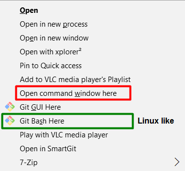

# Malayalam Mozhi Keyman Keybaord
## mlym-mozhi-Keyman
Mozhi is one of most popular phonetic keyboarding scheme for Malayalam script. It was originally designed by Cibu for the Varamozhi project and he still maintains the [Mozhi specification](https://sites.google.com/site/cibu/mozhi/mozhi2).

## Keyman
This project implements the Mozhi layout in [Keyman 9](https://keyman.com/), the popular keyboarding application. Starting from release Keyman 9.0.528.0, the program is again made available as a free program by [SIL International](www.sil.org) after they [acquired Tavoultesoft](https://keyman.com/sil-acquisition/), the company that owned Keyman. This keyboard will support all the Malayalam Characters available in [Unicode 10](http://unicode.org/charts/PDF/U0D00.pdf).

## How to collaborate on this project
You are welcomed to collaborate in this project. The Keyman keybaord development is not a big task. So even if you are not a developer, you can still contribute to this project. To participate in this project you'll need the Keyman Developer application, which can be downloaded from [here](https://keyman.com/developer/). Once you download and install Keyman desktop on your computer, visit the [Developer Support page](https://help.keyman.com/developer/9.0/guides/) and [Keyman Keyboard Languge page](https://help.keyman.com/developer/language/) to learn more about how to write Keyman Keybaords.

### Setting up your system for collaboration
We will use the [Git Forking Workflow](https://www.atlassian.com/git/tutorials/comparing-workflows#forking-workflow) for this project. Take a moment to read through this link and learn the workflow and philosophy. If you are new you git and version controlling system, you may want to take the interactive training offered on the [Atlasian Website](https://www.atlassian.com/git/tutorials/learn-git-with-bitbucket-cloud).

Here is an overview of the workflow
  - Fork this repository.
  - Clone your copy into a convenient location on your computer. (If you haven't already installed a git client download and install one. Once you have a git client installed, open a Command Window (Right click on your folder while holding down the `Shift` key, and select the option, `Open Command Window Here`.
  


```shell
C:\Users\ben\Documents\Work\Mozhi> git clone https://github.com/beniza/mlym-mozhi-Keyman.git
```
 
